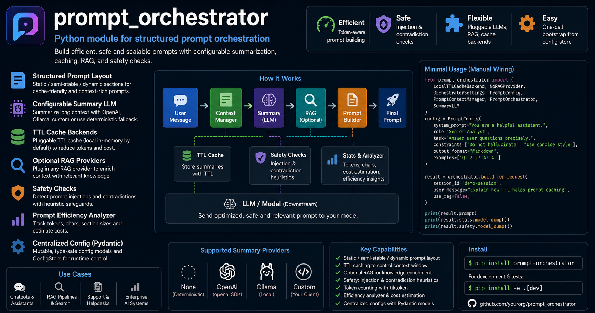

# prompt_orchestrator



Python module for structured prompt orchestration with:

- static/semi-stable/dynamic prompt layout
- configurable summary LLM with provider selection
- TTL cache backends
- optional RAG providers
- safety checks (config-driven grouped threats, weighted groups, bilingual patterns, contradiction pairs)
- prompt efficiency analyzer
- token counting with tiktoken
- centralized mutable config (Pydantic)
- one-call orchestrator bootstrap from config store

## Install

```bash
pip install -e .
```

For development and tests:

```bash
pip install -e .[dev]
```

Install with optional OpenTelemetry support:

```bash
pip install -e .[otel]
```

## Optional OpenTelemetry + SigNoz

OpenTelemetry is optional. If not installed or not enabled, PromptOrchestrator works as before.

SigNoz is expected to run separately (for example, official SigNoz Docker deployment on `http://localhost:8080`).

Enable OTel (host runtime):

```bash
ENABLE_OTEL=true
OTEL_EXPORTER_OTLP_ENDPOINT=localhost:4317
OTEL_SERVICE_NAME=prompt-orchestrator
OTEL_SERVICE_NAMESPACE=prompt-stack
OTEL_DEPLOYMENT_ENVIRONMENT=dev
```

Required/optional flags summary:

- Start telemetry export (required): set `ENABLE_OTEL=true`
- Stop telemetry export (required): set `ENABLE_OTEL=false`
- OTLP destination (optional, used when enabled): `OTEL_EXPORTER_OTLP_ENDPOINT`
- Resource labels (optional): `OTEL_SERVICE_NAME`, `OTEL_SERVICE_NAMESPACE`, `OTEL_DEPLOYMENT_ENVIRONMENT`, `OTEL_SERVICE_VERSION`

Run local OTel Collector (1 additional container):

```bash
docker compose -f docker-compose.otel.yml up -d
```

Disable OTel (host runtime):

```bash
ENABLE_OTEL=false
```

Stop local OTel Collector:

```bash
docker compose -f docker-compose.otel.yml down
```

Files used:

- `docker-compose.otel.yml`
- `observability/otel-collector-config.yaml`

Default endpoints:

- SigNoz UI (external): `http://localhost:8080`
- OTLP gRPC ingest (local collector): `http://localhost:4317`
- OTLP HTTP ingest (local collector): `http://localhost:4318`

Exposed telemetry (when enabled):

| Telemetry signal name | Description |
| --- | --- |
| `prompt_orchestrator.build_for_request` | Trace span for one prompt build request. Includes attribute `session.id`. |
| `prompt_build_requests_total` | Counter of prompt build attempts. Attributes include `operation=build_for_request` and `status` (`ok`/`error`). |
| `prompt_errors_total` | Counter of errors by operation and error type. Attributes include `operation` and `error.type`. |
| `prompt_build_latency_ms` | Histogram of prompt build latency in milliseconds. |
| `prompt_total_tokens` | Histogram of total token count in the built prompt payload. |
| `prompt_total_chars` | Histogram of total character count in the built prompt payload. |
| `prompt_rag_chunks_count` | Histogram of retrieved RAG chunks used in the prompt. |
| `prompt_warnings_count` | Histogram of analyzer warnings count per build. |
| `prompt_safety_events_total` | Counter of safety events. Attributes include `severity` and `status`. |
| `prompt_summary_calls_total` | Counter of summary calls. Attributes include `operation=summary`, `provider`, and `status`. |
| `prompt_summary_latency_ms` | Histogram of summary call latency in milliseconds. |
| `prompt.error operation={operation} error_type={error_type}` | OTLP log message emitted on errors (for example in `build_for_request` or `summary`). |

Dashboard template blueprint:

- `observability/signoz-dashboard-prompt-orchestrator.yaml`

Use it as a panel/query blueprint in SigNoz to create a dashboard for prompt build latency, token pressure, RAG payload size, safety events, summary latency, logs, and traces.

## Configuration Models

- `PromptConfig`: static prompt structure
- `OrchestratorSettings`: runtime limits and behavior
- `SummaryLLMConfig`: summary provider and model settings
- `SafetyLLMConfig`: optional LLM-based safety analysis (provider/model selectable)
- `ModuleConfig`: full module config in one object
- `ConfigStore`: mutable config holder (`get`, `set_config`, `as_dict`)

### Enterprise Prompt Controls

`PromptConfig` now includes enterprise-level controls for answer governance:

- `response_language`: `ru | en | auto` (default: `ru`)
- `output_contract`: strict output contract configuration
    - default `mode="json_markdown"`
    - default `strict=True`
    - default schema hint for enterprise review payload
- `tool_calling_policy`: tool usage policy for downstream tool-aware agents
    - `mode`: `allow | deny | allowlist` (default: `allow`)
    - `max_calls` (default: `8`)
    - `allowed_tools` for allowlist mode
    - JSON args/result acknowledgement guard flags

Example:

```python
from prompt_orchestrator import PromptConfig, OutputContractConfig, ToolCallingPolicyConfig

cfg = PromptConfig(
        system_prompt="Вы корпоративный ассистент.",
        role="Ревьюер документации",
        task="Сформируйте проверяемый ответ на русском.",
        constraints=["Не придумывайте факты", "Всегда давайте ссылки/цитаты"],
        output_format="Markdown",
        examples=[],
        response_language="ru",
        output_contract=OutputContractConfig(
                mode="json_markdown",
                strict=True,
                schema_hint='{"summary":"str","findings":["str"],"risks":["str"],"actions":["str"],"citations":["str"]}',
        ),
        tool_calling_policy=ToolCallingPolicyConfig(
                mode="allow",
                max_calls=8,
        ),
)
```

## Safety Engine

The safety layer is configured from [prompt_orchestrator/safety/threats.json](prompt_orchestrator/safety/threats.json). The catalog is grouped by threat family, and each family has its own weight so the final severity is still computed by the maximum matched threat score.

What changed:

- threat families are defined in `threats.json` and loaded at runtime
- regular lexical rules live under `patterns`
- contradiction rules live under `contradictions` and are matched as pairs
- each family can include English and Russian analogs for the same threat family
- duplicate patterns were removed from the catalog
- each matched rule keeps its threat code in the report

`SafetyReport` now includes:

- `issues`: flat list of matched safety issues
- `threat_groups`: grouped report by threat family
- `severity`: overall severity (`none`, `low`, `medium`, `high`)
- `threat_score`: weighted maximum score used for the final severity
- `sanitized_prompt`: optional rewritten prompt when auto rewrite is enabled
- `llm_used`: whether LLM safety analyzer was applied
- `llm_provider` / `llm_model`: provider/model used for LLM safety pass
- `llm_score` / `llm_severity`: raw LLM risk output before final merge
- `llm_reasoning`: short textual explanation returned by LLM checker

### Optional LLM Safety Layer

You can enable an additional LLM-based safety pass on top of lexical rules.

Default config:

- `security_checks_llm_enabled=False` (opt-in)
- `provider="ollama"`
- `model="qwen2.5:3b"` (multilingual, works with Russian prompts)
- `security_checks_llm_merge_strategy="max"` (take max risk between lexical + LLM)
- `security_checks_llm_fail_mode="open"` (fallback to lexical-only if LLM check fails)
- `security_checks_llm_auto_pull_ollama_model=True` (if model is missing, it is pulled from Ollama)

Important behavior:

- LLM provider clients are initialized lazily.
- If `security_checks_llm_enabled=False`, no LLM provider client is created.

Example:

```python
from prompt_orchestrator import ModuleConfig, SafetyLLMConfig

cfg = ModuleConfig(
    prompt=...,  # PromptConfig
    safety_llm=SafetyLLMConfig(
        security_checks_llm_enabled=True,
        provider="ollama",  # or "openai" / "custom" / "none"
        model="qwen2.5:3b",
        security_checks_llm_merge_strategy="max",  # max | llm_only | heuristic_only
        security_checks_llm_fail_mode="open",  # open | closed
    ),
)
```

Each grouped report includes the threat family name, the number of matches, the matched codes, and the family weight. Use `result.safety.grouped_summary` or `result.safety.model_dump()` to inspect the grouped output.

### OrchestratorSettings.debug_mode

By default, section headers (`=== STATIC PART (CACHE-FRIENDLY) ===`, etc.) are **excluded** from the final prompt sent to LLMs to save tokens. 

Enable `debug_mode=True` to include section headers for:
- Debugging and development
- Understanding prompt structure during testing
- Console/log output inspection

```python
settings = OrchestratorSettings(
    debug_mode=True,  # Enables section headers in output
)
```

In simulations, use `--debug` flag:
```bash
python simulations/console_pipeline_test.py  # Prompts for debug mode
python simulations/conversation_simulation_test.py --debug  # Enable debug headers
```

Security rewrite toggle in `OrchestratorSettings`:

- `security_checks_auto_rewrite=True`: rewrite prompt when safety severity is `medium` or `high`
- Legacy alias `safety_auto_rewrite` is still accepted for backward compatibility

## Supported Summary Providers

- `none`: deterministic local fallback summarization
- `openai`: OpenAI via `openai` SDK
- `ollama`: local Ollama endpoint via `/api/generate`
- `custom`: bring your own client implementing `generate(prompt, model, max_tokens, temperature)`

## Integration with RagflowOrchestrator

PromptOrchestrator can work directly with [RagflowOrchestrator](https://github.com/VeryComplexAndLongName/RagOrchestrator) as a retrieval backend.

Why this pairing works well:

- PromptOrchestrator controls prompt layout, context compaction, safety checks, and token budgets.
- RagflowOrchestrator handles indexing, embedding, and retrieval from vector storage.
- Both projects use a compatible `DocChunk` shape (`id`, `content`, `score`, `metadata`).

### Option 1: Use RagflowOrchestrator compatibility adapter (recommended)

RagflowOrchestrator includes `PromptStyleRAGProviderAdapter`, which exposes the exact interface PromptOrchestrator expects (`retrieve(query, limit)`).

```python
from prompt_orchestrator import (
    LocalTTLCacheBackend,
    OrchestratorSettings,
    PromptConfig,
    PromptContextManager,
    PromptOrchestrator,
    SummaryLLM,
)

from ragflow_orchestrator import HashEmbedder, create_provider
from ragflow_orchestrator.rag import PromptStyleRAGProviderAdapter

# RagflowOrchestrator side: provider + embedder
provider = create_provider(kind="sqlite", db_path="rag.db", table="chunks")
embedder = HashEmbedder(dimensions=256)

# Adapter gives PromptOrchestrator-compatible retrieve(query, limit)
rag_provider = PromptStyleRAGProviderAdapter(provider=provider, embedder=embedder)

config = PromptConfig(
    system_prompt="You are a grounded assistant.",
    role="Engineer",
    task="Answer using retrieved context.",
    constraints=["Cite retrieved facts", "Avoid unsupported claims"],
    output_format="Markdown",
    examples=[],
)

settings = OrchestratorSettings(use_rag_default=True, rag_limit=4)
cache = LocalTTLCacheBackend(default_ttl_seconds=settings.cache_ttl_seconds)
context_manager = PromptContextManager(cache, settings, SummaryLLM())

orchestrator = PromptOrchestrator(
    config=config,
    context_manager=context_manager,
    rag_provider=rag_provider,
    settings=settings,
)

result = orchestrator.build_for_request(
    session_id="rag-integration-demo",
    user_message="How does deduplication work in our retrieval pipeline?",
    use_rag=True,
)

print(result.prompt)
```

### Option 2: Wrap RAGOrchestrator.search(...) in a thin adapter

If you already use a full `RAGOrchestrator` pipeline (ingest + search), expose it as a `RAGProvider` for PromptOrchestrator:

```python
from prompt_orchestrator.rag.base import RAGProvider
from prompt_orchestrator.context.state import DocChunk

from rag_orchestrator import RAGOrchestrator


class RagOrchestratorProvider(RAGProvider):
    def __init__(self, orchestrator: RAGOrchestrator) -> None:
        self._orchestrator = orchestrator

    def retrieve(self, query: str, limit: int) -> list[DocChunk]:
        rows = self._orchestrator.search(query_text=query, top_k=limit)
        return [
            DocChunk(
                id=row.chunk.id,
                content=row.chunk.text,
                score=row.score,
                metadata={str(k): str(v) for k, v in row.chunk.metadata.items()},
            )
            for row in rows
        ]
```

Use this adapter as `rag_provider` in `PromptOrchestrator(...)` and set `use_rag=True` when building requests.

## Simulations Folder

Simulation assets are located in [simulations](simulations):

- [simulations/console_pipeline_test.py](simulations/console_pipeline_test.py): interactive console runner for manual checks
- [simulations/conversation_simulation_test.py](simulations/conversation_simulation_test.py): scripted multi-turn simulation with prompt/STATS/SAFETY output
- [simulations/test_turns.json](simulations/test_turns.json): regular conversation turns for context-window and compaction checks
- [simulations/safety_injection_turns.json](simulations/safety_injection_turns.json): unsafe/injection turns for SAFETY trigger checks
- [simulations/conversation_simulation_test.log](simulations/conversation_simulation_test.log): output log from last simulation run (overwritten on each run)

How to work with simulations:

```bash
# Interactive pipeline (manual typing)
python simulations/console_pipeline_test.py

# Scripted simulation from JSON turns
python simulations/conversation_simulation_test.py

# Include unsafe/injection scenarios
python simulations/conversation_simulation_test.py --include-safety

# Run without RAG and cap turns
python simulations/conversation_simulation_test.py --no-rag --max-turns 5
```

## Example 1: Manual Wiring (Local, No RAG)

```python
from prompt_orchestrator import (
    LocalTTLCacheBackend,
    NoRAGProvider,
    OrchestratorSettings,
    PromptConfig,
    PromptContextManager,
    PromptOrchestrator,
    SummaryLLM,
)

config = PromptConfig(
    system_prompt="You are a helpful assistant.",
    role="Senior Analyst",
    task="Answer user questions precisely.",
    constraints=["Do not hallucinate", "Use concise style"],
    output_format="Markdown",
    examples=["Q: 2+2? A: 4"],
)

settings = OrchestratorSettings(
    max_prompt_chars=12000,
    max_prompt_tokens=3000,
    recent_messages_limit=10,
    cache_ttl_seconds=900,
    rag_limit=3,
)

cache = LocalTTLCacheBackend(default_ttl_seconds=settings.cache_ttl_seconds)
summary_llm = SummaryLLM()
context_manager = PromptContextManager(cache, settings, summary_llm)

orchestrator = PromptOrchestrator(
    config=config,
    context_manager=context_manager,
    rag_provider=NoRAGProvider(),
    settings=settings,
)

result = orchestrator.build_for_request(
    session_id="demo-session",
    user_message="Explain how TTL helps prompt caching",
    use_rag=False,
)

print(result.prompt)
print(result.stats.model_dump())
print(result.safety.model_dump())
```

## Example 2: Centralized Config + Factory (One-Call Bootstrap)

```python
from prompt_orchestrator import (
    ConfigStore,
    ModuleConfig,
    OrchestratorSettings,
    PromptConfig,
    SummaryLLMConfig,
    PromptOrchestratorFactory,
)

full_config = ModuleConfig(
    prompt=PromptConfig(
        system_prompt="You are a helpful assistant.",
        role="Engineer",
        task="Answer clearly",
        constraints=["No hallucinations"],
        output_format="Markdown",
        examples=[],
    ),
    settings=OrchestratorSettings(max_prompt_tokens=3000),
    summary_llm=SummaryLLMConfig(provider="openai", model="gpt-4o-mini"),
)

store = ConfigStore(full_config)
model_name = store.get("summary_llm.model")

orchestrator = PromptOrchestratorFactory.from_config_store(store)
result = orchestrator.build_for_request(
    session_id="factory-demo",
    user_message="What is TTL cache?",
    use_rag=False,
)
```

## Example 3: OpenAI Summary Provider

```python
from prompt_orchestrator import (
    ConfigStore,
    ModuleConfig,
    OpenAIConfig,
    OrchestratorSettings,
    PromptConfig,
    PromptOrchestratorFactory,
    SummaryLLMConfig,
)

cfg = ModuleConfig(
    prompt=PromptConfig(
        system_prompt="You are a concise assistant.",
        role="Tech Writer",
        task="Summarize conversation state and answer user request.",
        constraints=["No speculative claims"],
        output_format="Markdown",
        examples=[],
    ),
    settings=OrchestratorSettings(
        max_prompt_tokens=2500,
        token_model="gpt-4o-mini",
    ),
    summary_llm=SummaryLLMConfig(
        provider="openai",
        model="gpt-4o-mini",
        openai=OpenAIConfig(
            api_key="YOUR_OPENAI_API_KEY",
            base_url=None,
            organization=None,
        ),
    ),
)

store = ConfigStore(cfg)
orchestrator = PromptOrchestratorFactory.from_config_store(store)
response = orchestrator.build_for_request(
    session_id="openai-summary",
    user_message="Please summarize previous decisions and next actions",
    use_rag=False,
)
print(response.stats.total_tokens)
```

## Token Counting (tiktoken)

- Prompt length checks use tiktoken-based counting
- Configure tokenizer via `OrchestratorSettings.token_model` and `OrchestratorSettings.token_encoding`
- Limit fitting in `PromptContextManager.ensure_fits_limit` trims sections to satisfy both char and token budgets

## Running Tests

```bash
pytest -q
```
